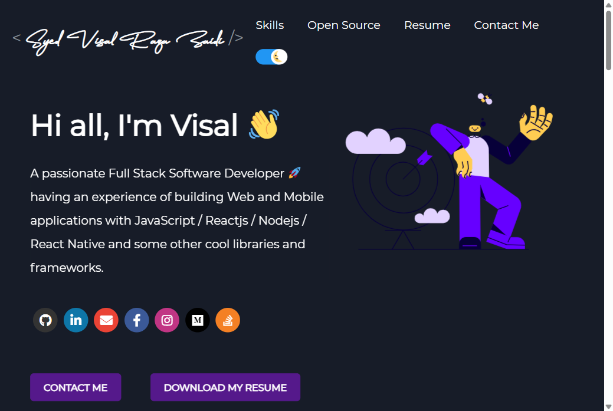

<div align="center">

# 🚀 Visal Raza Zaidi — Developer Portfolio

### A modern, responsive personal portfolio built with React — auto-syncs projects from GitHub and blogs from Medium.

[](https://reactjs.org/)
[](https://sass-lang.com/)
[](https://developer.mozilla.org/docs/Web/JavaScript)
[](./LICENSE)
[](https://github.com/VisalRazaZaidi/visalraza-portfolio/pulls)

<!-- Add your live URL once deployed, e.g. https://visalrazazaidi.github.io/visalraza-portfolio -->
**[✨ Live Demo](#) · [🐛 Report Bug](https://github.com/VisalRazaZaidi/visalraza-portfolio/issues) · [💡 Request Feature](https://github.com/VisalRazaZaidi/visalraza-portfolio/issues)**

</div>

---

## 📸 Preview

<div align="center">

<!-- Drop a screenshot at docs/screenshot.png (a full-page capture of the running site works great) -->


</div>

---

## 📖 About

A single-page developer portfolio that stays up to date on its own. Point it at your GitHub username and it pulls in your **pinned repositories** at build time; point it at Medium and it pulls in your latest **blog posts**. Everything else — sections, colors, links, content — is driven from a single config file, [`src/portfolio.js`](src/portfolio.js).

Based on the excellent [DeveloperFolio](https://github.com/saadpasta/developerFolio) template, customized for my own work.

## ✨ Features

- 🎬 **Animated splash screen** (Lottie)
- 👋 **Greeting** with one-click résumé download
- 🧠 **Skills** showcase with Font Awesome tech icons
- 🎓 **Education** timeline
- 📊 **Proficiency bars** + CodersRank integration
- 🐙 **Open-source projects** — auto-fetched from your **GitHub pinned repos**
- 💼 **Featured big projects** with live links
- 📝 **Blogs** — auto-fetched from **Medium** (optional)
- 🏆 Achievements, Talks, Podcasts, Twitter feed (all toggleable)
- ☎️ **Contact** section
- 🌗 **Dark / Light** theme toggle
- 📱 Fully **responsive** across devices

> Every section can be turned on/off with a single `display` flag in [`src/portfolio.js`](src/portfolio.js).

## 🛠️ Tech Stack

<div align="center">

[](https://skillicons.dev)

</div>

- **Framework:** React 16 (Create React App / react-scripts 5)
- **Styling:** Sass / SCSS
- **Data:** GitHub GraphQL API (projects) + Medium RSS via rss2json (blogs), fetched by [`fetch.js`](fetch.js)
- **Extras:** `lottie-react`, `react-reveal`, `react-headroom`, `colorthief`
- **Deploy:** `gh-pages`

## 🚀 Getting Started

### Prerequisites

- **Node.js** `>= 14` and **npm**
- A **classic** GitHub Personal Access Token (see note below ⚠️)

### 1. Clone & install

```bash
git clone https://github.com/VisalRazaZaidi/visalraza-portfolio.git
cd visalraza-portfolio
npm install
```

### 2. Configure environment

Copy the example and fill in your details:

```bash
cp env.example .env
```

```env
REACT_APP_GITHUB_TOKEN = "ghp_your_classic_token_here"
GITHUB_USERNAME        = "VisalRazaZaidi"
USE_GITHUB_DATA        = "true"
MEDIUM_USERNAME        = "visalraza"
```

> ### ⚠️ Use a **classic** token, not a fine-grained one
> The GitHub **GraphQL** API blocks fine-grained tokens (`github_pat_…`) from fields like `stargazers`, which makes every pinned repo come back `null` and the Projects section render empty.
>
> Create a **classic** token at **[github.com/settings/tokens](https://github.com/settings/tokens)** → *Tokens (classic)* with the **`repo`** (or `public_repo`) + **`read:user`** scopes. It should start with `ghp_`.

### 3. Run

```bash
npm start
```

This runs [`fetch.js`](fetch.js) to snapshot your GitHub/Medium data into `public/profile.json`, then starts the dev server at **http://localhost:3000**.

> 🔄 **Data is a build-time snapshot.** Whenever you change your pinned repos or publish a blog, re-run `npm start` (or `node fetch.js`) to refresh it.

## 🧩 Customization

Almost everything lives in one file — **[`src/portfolio.js`](src/portfolio.js)**:

| Want to change… | Edit |
| --- | --- |
| Name, greeting, résumé link | `greeting` |
| Social links | `socialMediaLinks` |
| Skills & tech icons | `skillsSection` |
| Education | `educationInfo` |
| Proficiency bars | `techStack` |
| Featured projects | `bigProjects` |
| Show/hide any section | its `display: true/false` flag |
| Global colors | [`src/_globalColor.scss`](src/_globalColor.scss) |
| Résumé PDF | replace [`src/containers/greeting/resume.pdf`](src/containers/greeting/resume.pdf) |

## 📦 Build & Deploy

```bash
npm run build     # production build → build/
npm run deploy    # publish build/ via gh-pages
```

## 🗂️ Project Structure

```
visalraza-portfolio/
├── fetch.js                 # Fetches GitHub + Medium data → public/profile.json
├── public/                  # Static assets + generated profile.json
└── src/
    ├── portfolio.js         # 🎯 Main config — edit this
    ├── _globalColor.scss    # Global theme colors
    ├── containers/          # Page sections (greeting, projects, skills, …)
    ├── components/          # Reusable UI (buttons, cards, header, …)
    └── contexts/            # Theme (dark/light) context
```

## 🤝 Connect

<div align="center">

[](https://www.linkedin.com/in/vrxaidi/)
[](https://github.com/VisalRazaZaidi)
[](https://medium.com/@visalraza)
[](https://stackoverflow.com/users/22935096/syed-visal-raza-zaidi)
[](https://www.instagram.com/syedvisalr.zaidi/)
[](mailto:visalraza@gmail.com)

</div>

## 🙏 Acknowledgements

Built on top of [**DeveloperFolio**](https://github.com/saadpasta/developerFolio) by [Saad Pasta](https://github.com/saadpasta).

## 📄 License

Distributed under the **GPL-3.0** License. See [`LICENSE`](./LICENSE) for details.

<div align="center">

Made with ❤️ &nbsp;in Pakistan 🇵🇰 by **Syed Visal Raza Zaidi**

⭐ If you like this portfolio, consider giving it a star!

</div>
